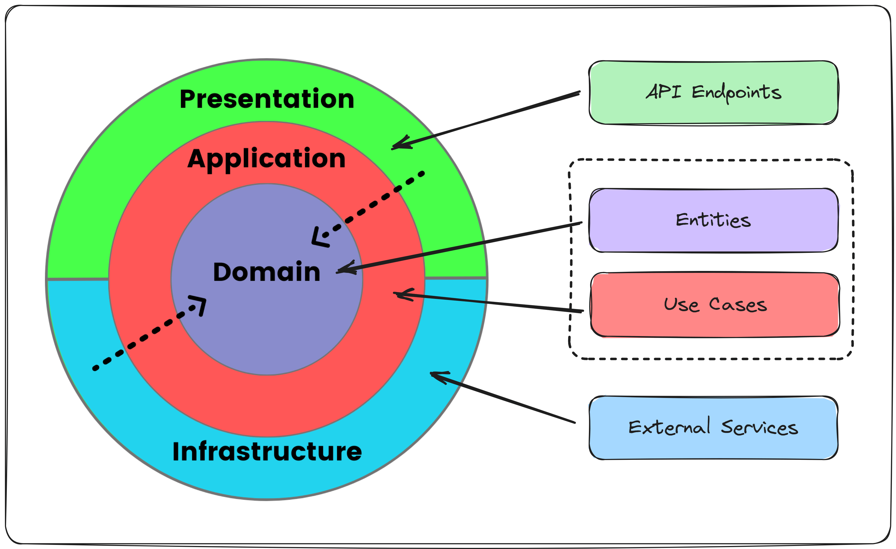

# Clean Architecture
* [Domain Layer](#domain-layer)
* [Application Layer](#application-layer)
* [Infrastructure Layer](#infrastructure-layer)
* [Presentation Layer](#presentation-layer)

# Domain Layer
* Entities
* Value Objects
* Domain Events
* Domain Services
* Interfaces
* Exceptions
* Enums

# Application Layer
* Orchestrates the Domain
* Contains Business Logic
* Defines Use Cases
  * Application Services
  * CQRS (with Mediatr for example)

# Infrastructure Layer
Interacts with External Systems:
* Databases
* Messaging
* Email Providers
* Storage Services 
* Identity Provider
* System Clock

# Presentation Layer
Responsible for interacting with the users.

* Defines the Entry Point to the System
* gRPC Service
* REST API
  * API Endpoints
  * Middleware
  * DI Setup
